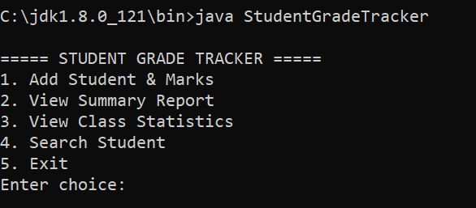
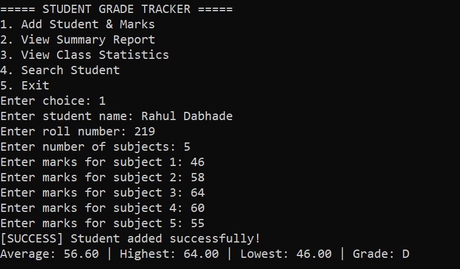
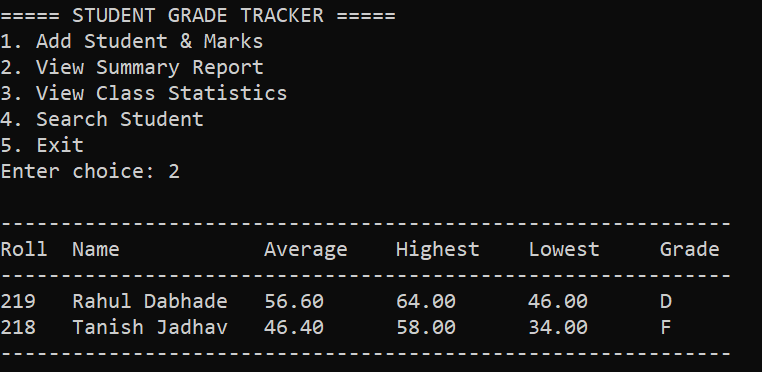
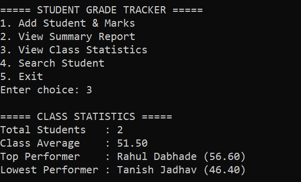
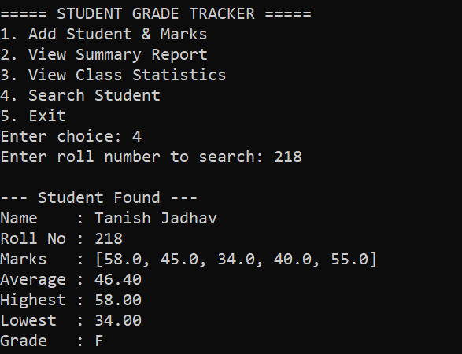

# Student Grade Tracker

## Overview

Student Grade Tracker is a Java-based console application that helps manage student records, marks, grades, and class statistics.

## Features

* Add student details
* Store marks for multiple subjects
* Calculate average marks
* Find highest and lowest marks
* Assign grades automatically
* Search students by roll number
* Generate summary reports
* View class statistics

## Technologies Used

* Java
* ArrayList
* Object-Oriented Programming (OOP)

## How to Run

Compile:
javac StudentGradeTracker.java

Run:
java StudentGradeTracker

## Sample Output

===== STUDENT GRADE TRACKER =====

1. Add Student & Marks
2. View Summary Report
3. View Class Statistics
4. Search Student
5. Exit

## Screenshots

### Main Menu

### Add Student

### Summary Report

### Class Statistics

### Search Student

## Author

Prasit Bankar

